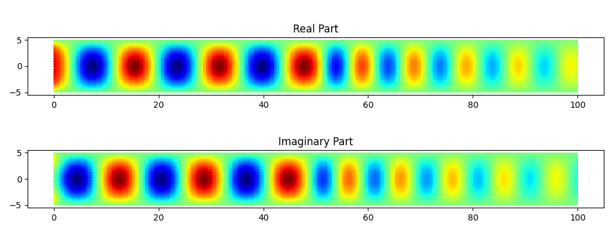

# Helmi_FEM
An open-source implementation of the Helmholtz equation for finite element analysis of electromagnetic wave propagation and scattering.

Based on [scikit-fem](https://scikit-fem.readthedocs.io/en/latest/index.html) for finite element assembly and on [SciPy](https://scipy.org/), [NumPy](https://numpy.org/), and [matplotlib](https://matplotlib.org/) for solving, processing and plotting.

## Installation:
```python
pip install git+https://github.com/Vinc0110/Helmi_FEM.git
```

See the example workflow below and additional examples in the subfolder.



## Features:
 - Supports complex-valued parameters
 - TE and TM polarization
 - Dirichlet and third-order boundary conditions (Neumann, freespace, absorbing)
 - Near-field to far-field transformation

# Workflow
## 1. Create or load a mesh of the simulation domain
Use the mesh constructors of `skfem.mesh` for simple shapes such as rectangles, circles, or L-shapes. 
Use *gmsh* or other software for complex shapes.

https://scikit-fem.readthedocs.io/en/latest/api.html#module-skfem.mesh

http://gmsh.info/

```python
import skfem
import numpy as np

# create a rectangular mesh with skfem:
x_pts = np.linspace(0, 100, 101)
y_pts = np.linspace(-5, 5, 21)
mesh = skfem.MeshTri.init_tensor(x_pts, y_pts)
mesh = mesh.with_subdomains({'air': lambda x: x[0] < 50,
                             'plastic': lambda x: x[0] >= 50})
mesh = mesh.with_boundaries({'bound_xmin': lambda x: np.isclose(x[0], x_pts[0]),
                             'bound_xmax': lambda x: np.isclose(x[0], x_pts[-1]),
                             'bound_ymin': lambda x: np.isclose(x[1], y_pts[0]),
                             'bound_ymax': lambda x: np.isclose(x[1], y_pts[-1])})

# alternatively, load a mesh from file:
mesh = skfem.Mesh.load('mymesh.msh')
```

## 2. Choose a finite element from `skfem.element`. 
https://scikit-fem.readthedocs.io/en/latest/api.html#module-skfem.element

``` python
element = skfem.ElementTriP2()
fem = Helmholtz(mesh, element)
```

## 3. Assemble the domains and the boundaries
The Helmholtz equation is implemented as a general second-order partial differential equation:

$- \alpha (\frac{\partial^2 \Phi}{\partial x^2} + \frac{\partial^2 \Phi}{\partial y^2}) + \beta \Phi = f$.

The electromagnetic wave propagation can be formulated in two different ways, depending on the polarization of interest:
1) TM polarization: $\Phi = E_Z$, $\alpha = 1 / \mu_r$, $\beta = -k_0^2 \epsilon_r$, and $f = -j k_0 Z_0 J_Z$
2) TE polarization: $\Phi = H_Z$, $\alpha = 1 / \epsilon_r$, $\beta = -k_0^2 \mu_r$, and $f = \frac{1}{\epsilon_r} (\frac{\partial J_Y}{\partial x} - \frac{\partial J_X}{\partial y})$

with the normalized free-space vacuum wave number $k_0 = \frac{2 \pi}{\lambda_0} = \frac{2 \pi f}{c_0}$. 
Here, $c_0$ is propagation velocity (speed of light) in vacuum, expressed in *mesh units per second*.

For $f = 10 GHz$ and a mesh unit of $a = 1 mm$, one gets $k_0 \approx \frac{2 \pi 10 GHz}{3e8 m/s / 1mm} \approx 0.209$.

For a mesh with two different subdomains labeled 'air' and 'plastic', the domains are assembled with their respective parameters:
```python
k0 = 0.5
eps_air = 1
mu_air = 1
eps_plastic = 2 - 0.1j
mu_plastic = 1
fem.assemble_subdomains(alpha={'air': 1 / mu_air, 
                               'plastic': 1 / mu_plastic}, 
                        beta={'air': -1 * k0 ** 2 * eps_air, 
                              'plastic': -1 * k0 ** 2 * eps_plastic}, 
                        f={'air': 0, 
                           'plastic': 0})
```

Similarly, the boundary conditions are defined. In this example, the upper and lower boundaries, labeled as 'bound_ymax' and 'bound_ymin', are supposed to be perfectly conducting (metallic) waveguide walls. 
The corresponding essential (Dirichlet) boundary condition is $E_Z = 0$:
```python
fem.assemble_boundaries_dirichlet(value={'bound_ymin': 0, 
                                         'bound_ymax': 0})
```

The boundaries on the left and right, labeled 'bound_xmin' and 'bound_xmax', are supposed to be waveguide interfaces that are artificially extended to behave like infinite waveguides for the fundamental propagation mode.
This can be formulated with the third-order boundary condition:
$\alpha (\frac{\partial \Phi}{\partial x} \hat{x} + \frac{\partial \Phi}{\partial y} \hat{y}) \hat{n} + \gamma \Phi = q$.
Here, $\hat{x}$, $\hat{y}$, and $\hat{n}$ are unit vectors in x and y direction, and outward normal to the boundary, respectively.

The desired waveguide boundary condition is obtained with $\gamma = \alpha \cdot 1j \cdot k_0$. 
For the excitation, an incident field $E_{Z,inc} = 1$ is added with $q = \alpha \cdot 2j \cdot k_0$ on the left boundary.
The natural (Neumann) boundary condition is a special case with $\gamma = q = 0$, which does not have to be stated explicitly.

```python
fem.assemble_boundaries_3rd(gamma={'bound_xmin': 1 / mu_plastic * 1j * k0, 
                                   'bound_xmax': 1 / mu_plastic * 1j * k0}, 
                            q={'bound_xmin': 1 / mu_plastic * 2j * k0, 
                               'bound_xmax': 0})
```

## 4. Solve the linear system for the field solution
```python
fem.solve()
```

## 5. Process the solution
After solving, the field solution is stored in `fem.phi` as a complex vector. The individual real and imaginary parts are also stored seperately in `fem.phi_re` and `fem.phi_im`.

The corresponding locations of the `N` elements in the solution vector on the mesh are stored in `fem.basis.doflocs`, which has the shape `(2, N)`.

scikit-fem offers helper functions to find certain elements, for example by means of labeled subdomains or boundaries:
```python
x_bound_xmin, y_bound_xmin = fem.basis.doflocs[:, fem.basis.get_dofs('bound_xmin')]
```

Plotting is simple with the functions in `skfem.visuals`:
```python
from skfem.visuals.matplotlib import plot
import matplotlib.pyplot as mplt

fig, ax = mplt.subplots(2, 1)
plot(fem.basis, fem.phi_re, ax=ax[0])
plot(fem.basis, fem.phi_im, ax=ax[1])
ax[0].set_aspect(1)
ax[1].set_aspect(1)
mplt.tight_layout()
mplt.show()
```