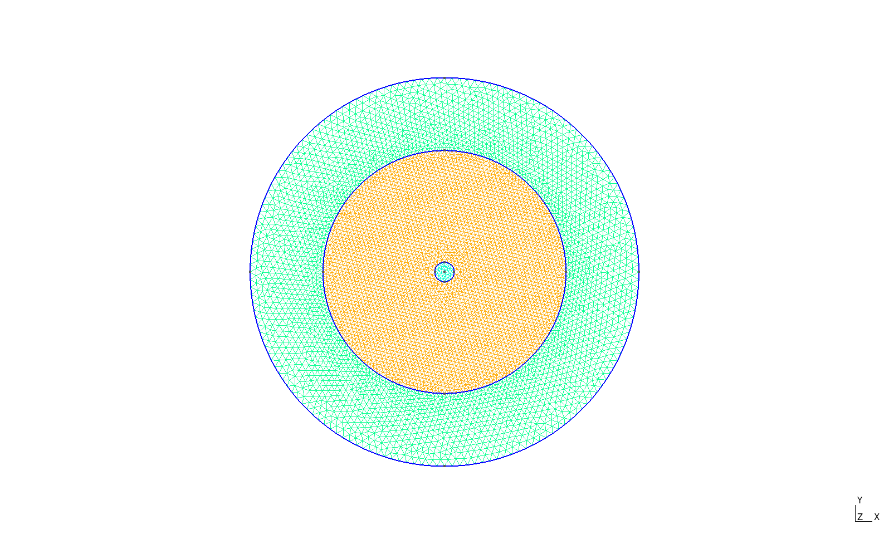
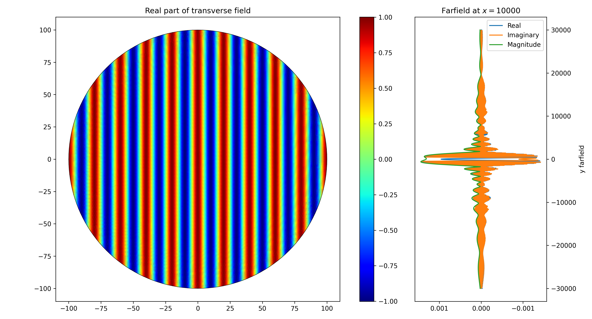
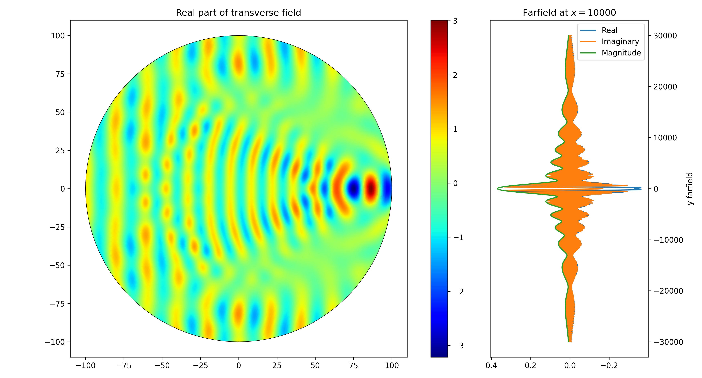

# Scattering from a dielectric fiber

## Mesh
Three subdomains with circular boundaries/interfaces:
- 'air': Outside domain surrounding the scatterer
- 'cladding': Outside part of the scatterer (cladding of an optical fiber)
- 'core': Inside part of the scatterer (core of an optical fiber)

## Subdomain parameters
The subdomain parameters are defined for TM polarization:
- $\alpha_{air} = 1 / \mu_{air}$
- $\alpha_{core} = 1 / \mu_{core}$
- $\alpha_{cladding} = 1 / \mu_{cladding}$
- $\beta_{air} = -k_0^2 \epsilon_{air}$
- $\beta_{core} = -k_0^2 \epsilon_{core}$
- $\beta_{cladding} = -k_0^2 \epsilon_{cladding}$

The freespace wavenumber is defined with the desired wavelength of the laser source of 20 µm: $k_0 = \frac{2 \pi}{20}$.

## Absorbing boundary condition
The general third-order boundary condition $\alpha \frac{\partial \Phi}{\partial \hat{n}} + \gamma \Phi = q$ can be used to formulate the boundary conditions for a first-order or second-order absorber.
A first-order absorbing boundary is obtained with the following equations for $\gamma$ and $q$:
- $\gamma = \alpha (j k_0 + \frac{\kappa(s)}{2})$
- $q = \alpha \frac{\partial \Phi_{inc}}{\partial \hat{n}} + \gamma \Phi_{inc}$

where $\Phi_{inc}$ is the incident (source) field, $\kappa(s)$ is the curvature of a section $s$ on the boundary.

A second-order absorbing boundary condition also depends on the second derivatives of the total (unknown) field $\Phi$ and the incident field $\Phi_{inc}$ with respect to the section $s$:
- $\gamma = \gamma_1 + \gamma_2 \frac{\partial^2}{\partial s^2}$
- $\gamma_1 = \alpha (j k_0 + \frac{\kappa(s)}{2} - \frac{j \kappa(s)^2}{8(j \kappa(s) - k_0)))}$
- $\gamma_2 = \frac{j \alpha}{2(j \kappa(s) - k_0)}$
- $q = \alpha \frac{\partial \Phi_{inc}}{\partial \hat{n}} + \gamma_1 \Phi_{inc} + \gamma_2 \frac{\partial^2 \Phi_{inc}}{\partial s^2}$

## Solution without the scatterer
An empty domain is created with $\epsilon_{air} = \epsilon_{cladding} = \epsilon_{core} = 1$:

## Solution with the scatterer
The scattering is simulated with $\epsilon_{air} = 1$, $\epsilon_{cladding} = 1.444^2$, and $\epsilon_{core} = 1.4475^2$:
