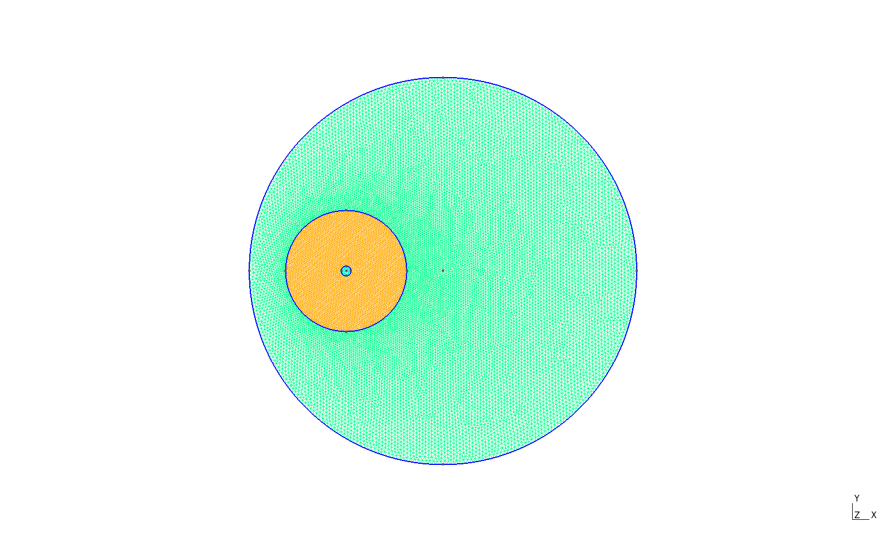

# Scattering from a dielectric fiber

## Mesh
Three subdomains with circular boundaries/interfaces:
- 'air': Outside domain surrounding the scatterer
- 'cladding': Outside part of the scatterer (cladding of an optical fiber)
- 'core': Inside part of the scatterer (core of an optical fiber)

## Solution without the scatterer
An empty domain is created with $\epsilon_{air} = \epsilon_{cladding} = \epsilon_{core} = 1$:

## Solution with the scatterer
The scattering is simulated with $\epsilon_{air} = 1$, $\epsilon_{cladding} = 1.444^2$, and $\epsilon_{core} = 1.4475^2$:
