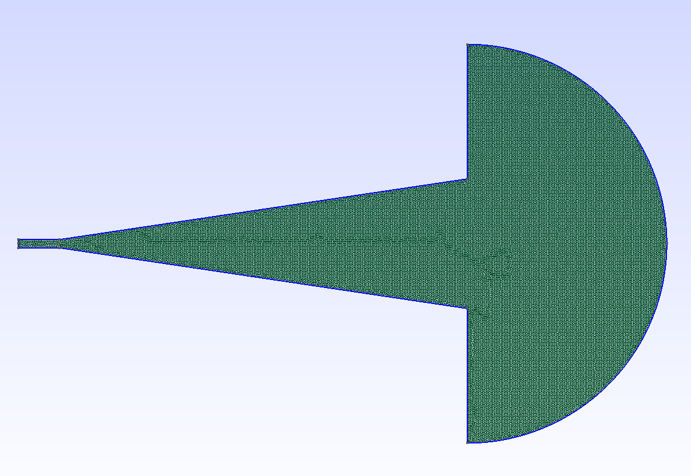
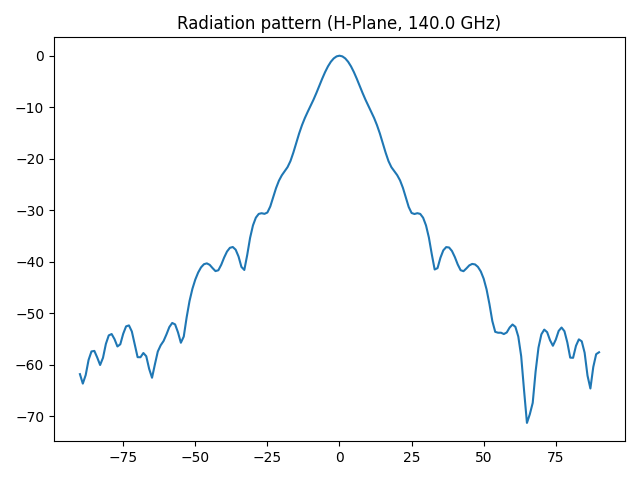
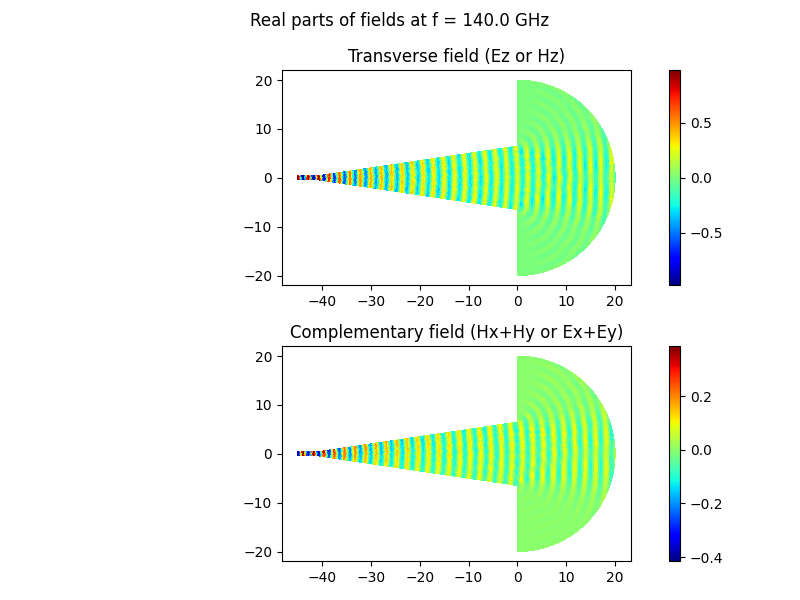
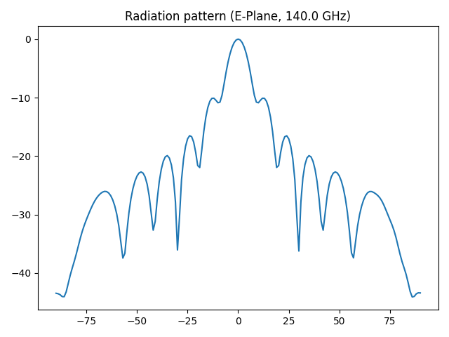

# Standard Gain Horn Example
Simulation of a 25 dBi standard gain horn with a WR-6 waveguide for single-mode operation from 110 GHz to 170 GHz.
See Pasternack PEWAN1028 for dimensions and reference data (https://www.pasternack.com/images/ProductPDF/PEWAN1028.pdf).

The mesh is created with gmsh for either the H-plane or the E-plane. 
The geometry consists of the waveguide on the left, the horn taper in the center, and a semi-circular free-space domain.

## H-Plane Simulation
The H-plane is the plane spanned by the H field vector with its Hx and Hy components. 
It is perpendicular to the transverse E field, and it cuts through the center of the antenna.
In the H-plane, the waveguide and horn widths are given by the greater of the two dimensions of the rectangular cross-section.

Accordingly, the problem is defined in terms of the Ez field. 
The complementary Hx and Hy fields can be calculated in post-processing with $H = \frac{1}{-j \omega \mu} \rot E$.

The radiation pattern is obtained from the far fields as calculated with a near-field to far-field transformation.

## E-Plane Simulation
The E-plane is the plane spanned by the E field vector with its Ex and Ey components. 
It is perpendicular to the transverse H field, and it cuts through the center of the antenna.
In the E-plane, the waveguide and horn widths are given by the smaller of the two dimensions of the rectangular cross-section.

Accordingly, the problem is defined in terms of the Hz field. 
The complementary Ex and Ey fields can be calculated in post-processing with $E = \frac{1}{j \omega \epsilon} \rot H$.

The radiation pattern is obtained from the far fields as calculated with a near-field to far-field transformation.

